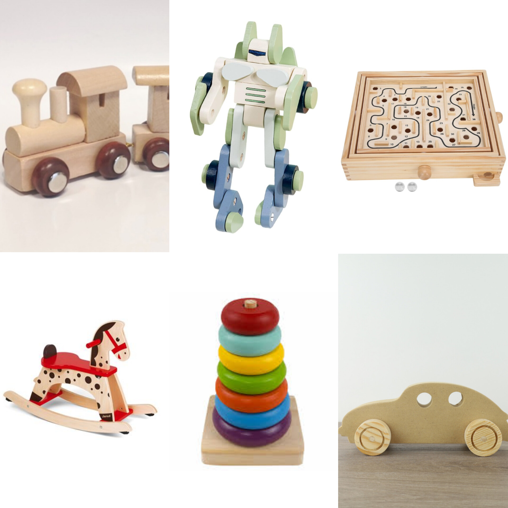
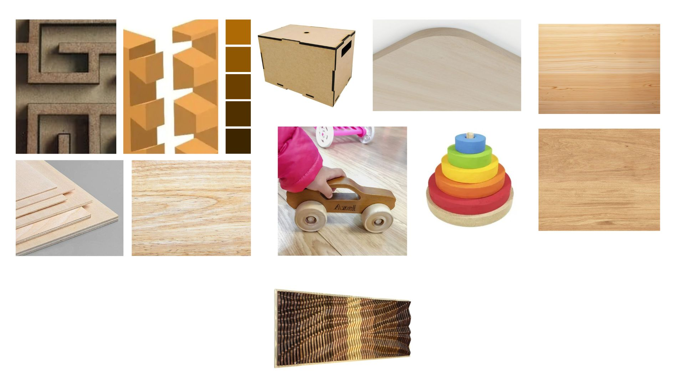
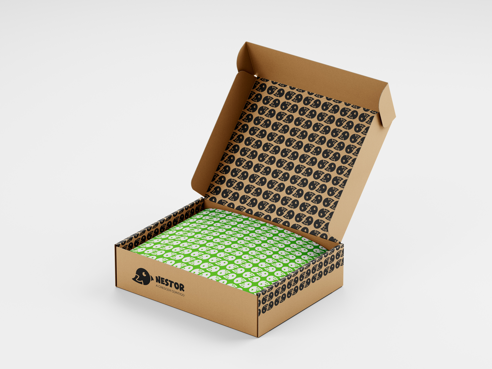

# Contexto de Design

Página explicativa do contexto, em concordância com a apresentação produzida em grupo. Componente de **grupo**.

## 1. Resumo / Abstract

> Máximo 500 palavras. Preferencialmente em **PT** e **EN**.

### Resumo (PT)

O projeto **Nestor** nasce com uma missão nobre: combater o desperdício florestal e transformar madeira que seria descartada em brinquedos ecológicos e pedagógicos para crianças. O combate ao desperdício é feito de forma simples e eficiente através da economia circular. No processo de fabrico, todas as sobras de madeira que não foram aproveitadas no corte principal por **CNC (Controlo Numérico Computadorizado)** são recuperadas. Em vez de se tornarem resíduos, estes restos ganham uma nova vida, sendo transformados em peças de brincadeira.

A escolha da **madeira de pinho** para esta coleção foi estratégica. Sendo um material de baixo custo e elevada sustentabilidade, o pinho é ideal para o processamento em máquinas CNC devido à sua baixa densidade. Além disso, a sua ausência de toxicidade natural garante total segurança para o manuseio infantil. Optou-se por manter a madeira no seu estado puro e natural para conectar os mais novos com a natureza. Cada peça funciona como uma tela em branco, dando às crianças a liberdade de pintar e personalizar o seu próprio brinquedo, estimulando o pensamento criativo. Outro grande propósito da Nestor é combater o uso excessivo das tecnologias digitais, que muitas vezes prejudicam o desenvolvimento físico e cognitivo na infância. Para contrariar os ecrãs, a marca desenvolveu alternativas estimulantes que desafiam a mente e o corpo através do tato e da exploração real.

Esta coleção foi desenhada para acompanhar o crescimento da criança ao longo dos seus primeiros anos de vida, cobrindo uma faixa etária **dos 1 aos 10 anos**, embora o seu design intemporal seja livre para todas as idades. O percurso pedagógico adapta-se ao ritmo de cada etapa, começando idealmente aos doze meses com o Carro de Empilhagem, focado na motricidade fina e na lógica. Progressivamente, o percurso evolui para o Cavalo de Baloiço, que desenvolve o equilíbrio e a motricidade grossa, passando depois pelo ComBot, que estimula a criatividade tridimensional e a desconstrução, e culminando no Labirinto, projetado para o raciocínio abstrato e para a concentração.

Em suma, a marca Nestor une a responsabilidade ecológica ao design de produto, provando que é possível ajudar a proteger o planeta ao mesmo tempo que se apoia o desenvolvimento saudável, criativo e contínuo das futuras gerações.

### Abstract (EN)

The **Nestor** project is born with a noble mission: to combat forestry waste and transform wood that would otherwise be discarded into eco-friendly and pedagogical toys for children. This fight against waste is achieved simply and efficiently through a circular economy framework. Throughout the manufacturing process, all wood remnants left over from the primary **CNC (Computer Numerical Control)** cutting are recovered. Instead of turning into waste, these scraps gain a second life, being repurposed into playful components.

The choice of **pine wood** for this collection was highly strategic. As a low-cost and highly sustainable material, pine is ideal for CNC machining due to its low density. Furthermore, its natural non-toxicity guarantees total safety for children's handling. The decision was made to keep the wood in its raw, natural state to foster a deep connection between children and nature. Each piece functions as a blank canvas, giving children the total freedom to paint and personalize their own toys, thereby stimulating creative thinking. Another major purpose of Nestor is to counter the excessive use of digital technologies, which frequently hinder physical and cognitive development during childhood. To challenge screens, the brand developed stimulating alternatives that engage the mind and body through touch and real-world exploration.

This collection was designed to accompany a child's growth throughout their early years, catering to an age range from **1 to 10 years old**, though its timeless design is open to all ages. The pedagogical journey adapts to the pace of each developmental stage, starting ideally at twelve months with the Stacking Car, which focuses on fine motor skills and logic. Progressively, the journey evolves toward the Rocking Horse to develop balance and gross motor skills, moves on to the ComBot to stimulate three-dimensional creativity and deconstruction, and culminates in the Maze, engineered for abstract reasoning and concentration.

In short, the Nestor brand merges ecological responsibility with product design, proving that it is possible to help protect the planet while supporting the healthy, creative, and continuous development of future generations.

## 2. Referências Coletivas

### 2.1. Recolha de Objetos a Redesenhar/Remisturar

Catálogo de objetos de partida que o grupo identificou para o redesenho. Para cada objeto: imagem, origem, motivo da escolha.

- **Labirinto** — O labirinto de madeira com esfera de metal é um dos brinquedos de coordenação mais icónicos do século XX. Inventado e patenteado na Suécia pela empresa BRIO em 1946, este brinquedo transformou o conceito milenar do labirinto num desafio físico de paciência e precisão.
Foi escolhido este brinquedo pois é uma brincadeira que incentiva a criatividade e a paciência, já que a criança precisa testar diferentes caminhos e estratégias para encontrar a saída, deparando-se com diversos desafios. Este  labirinto também pode ser uma forma divertida de melhorar a coordenação motora e a percepção espacial, tornando o aprendizado lúdico e envolvente e contribuindo para o desenvolvimento da criança.

- **Cavalo de Baloiço** — A história do cavalo de baloiço de madeira remonta ao século XVII. Originalmente, eram brinquedos luxuosos e caros, acessíveis apenas às famílias reais e à alta nobreza. Só a partir do século XIX, com a produção em massa, é que se tornaram mais acessíveis ao público em geral. Hoje, além de clássicos infantis, o conceito foi transformado em atrações turísticas em Portugal. 
O motivo da escolha deste tipo de brinquedo está associado à sua importância no desenvolvimento das crianças. O cavalo de baloiço de madeira é mais do que um brinquedo clássico. Ele promove o desenvolvimento físico ao melhorar o equilíbrio e a coordenação motora. Além disso, estimula a imaginação através de brincadeiras simbólicas e, graças ao seu movimento rítmico, ajuda a criança a relaxar sendo também um brinquedo que ajuda as crianças a compreender o seu próprio corpo e a orientarem-se no espaço enquanto balançam.

- **ComBot** — Os primeiros brinquedos de madeira e metal, frequentemente chumbo,  que se assemelhavam a comboios foram fabricados na Europa por volta de meados do século XIX. A maravilha tecnológica da locomotiva a vapor tinha surgido em força no início dos anos 1800, e muitas pessoas ficaram encantadas com a sua potência. Com a continuação da Revolução Industrial, surgiu a capacidade de produzir brinquedos e modelos à escala de vários tipos, e assim nasceram os comboios de brinquedo, de acordo com (Train Collectors Association, s.d.)
O ponto de partida para a escolha do comboio de madeira está associado à sua importância a nível da aprendizagem que impulsiona o crescimento das crianças de forma integrada. No plano do desenvolvimento cognitivo e raciocínio, este brinquedo desafia a mente a cada segundo. Como não há luzes nem sons eletrónicos para ditar o ritmo, a criança dita as suas próprias regras, o que promove o foco e a paciência, aumentando significativamente o tempo de atenção concentrada numa única atividade. Em paralelo, o manuseamento físico do brinquedo refina as habilidades motoras e sensoriais, fundamentais ao desenvolvimento da criança. O ato minucioso de alinhar e encaixar as calhas de madeira desenvolve a motricidade fina e a força muscular dos dedos, essencial para a futura escrita e desenvolvimento de outras competências que requerem manuseamento. Além disso, a riqueza da estimulação sensorial é única: o peso real da madeira, o som orgânico dos blocos a bater e a textura natural do material oferecem estímulos táteis ricos e calmantes, muito superiores à uniformidade fria do plástico, o que promove este contacto sensorial que permite o desenvolvimento de competências sociais essenciais para a criança estimulando também a criatividade. O brinquedo transforma-se num palco para a brincadeira simbólica, onde a criança cria narrativas complexas, inventa destinos, historias e significado da sua brincadeira permitindo também estimular a aprendizagem e o significado simbólico e organiza espaço onde o comboio se move. Além disso, é um brinquedo que se pode brincar em grupo reforçando a interação entre crianças e promovendo um espaço de partilha e de desenvolvimento das relações sociais.

- **Carrinho de Empilhagem** — Os brinquedos de empilhar em madeira são dos brinquedos educativos mais utilizados na primeira infância devido à sua simplicidade, durabilidade e valor pedagógico. Estes brinquedos consistem normalmente num conjunto de peças de diferentes formas, tamanhos ou cores que devem ser organizadas e empilhadas numa determinada estrutura. Existem diversas variantes como torres com discos, blocos geométricos, pirâmides de empilhagem e sistemas de encaixe. 
Uma das principais características destes brinquedos é a promoção da coordenação motora fina. Ao agarrar, posicionar e empilhar as peças, a criança desenvolve a precisão dos movimentos e a coordenação entre a visão e as mãos. Estas competências são fundamentais para atividades futuras como a escrita e o desenho.
Para além do desenvolvimento motor, os brinquedos de empilhar contribuem para o desenvolvimento cognitivo. A criança aprende a reconhecer formas, tamanhos, cores e relações espaciais, ao mesmo tempo que desenvolve capacidades de observação, concentração e resolução de problemas. O processo de descobrir como equilibrar ou organizar as peças estimula o raciocínio lógico e a perceção espacial. Outra característica importante é o incentivo à criatividade e à imaginação. Ao contrário de brinquedos eletrónicos com funções pré-definidas, os brinquedos de madeira permitem uma utilização mais aberta, possibilitando que a criança explore diferentes formas de brincar e crie as suas próprias construções e histórias.
A utilização da madeira apresenta também vantagens ao nível da sustentabilidade e da segurança. A madeira é um material renovável, resistente e durável, permitindo a criação de brinquedos com uma longa vida útil. Quando proveniente de fontes certificadas e acompanhada por acabamentos não tóxicos, constitui uma alternativa mais ecológica aos brinquedos produzidos em plástico.
### 2.2. Moodboard

Painel de referências visuais e conceptuais que orientam a estratégia do grupo.

### 3. Embalagem

A embalagem foi projetada para ser o mais minimalista possível, consistindo numa caixa de cartão simples que mantém a sua cor natural, remetendo diretamente para a rusticidade da madeira. A identidade visual é marcada com o logótipo da Nestor. Além disso, esta embalagem foi pensada para ser versátil, servindo uniformemente para todos os produtos da marca, o que otimiza a produção e reforça a nossa identidade ecológica.
