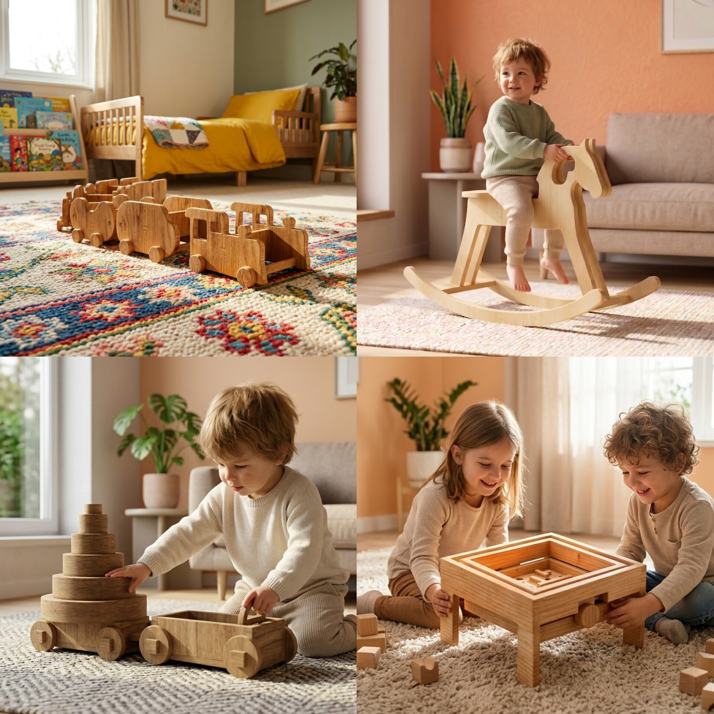
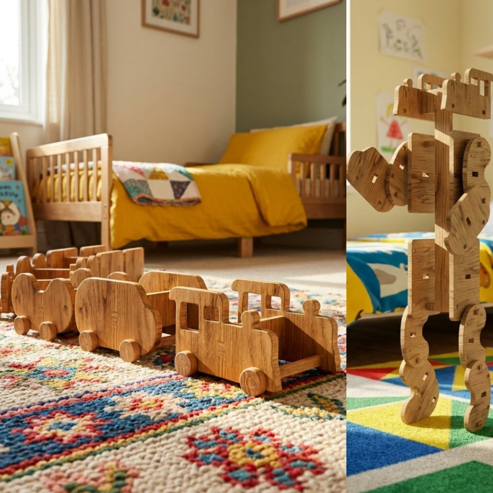
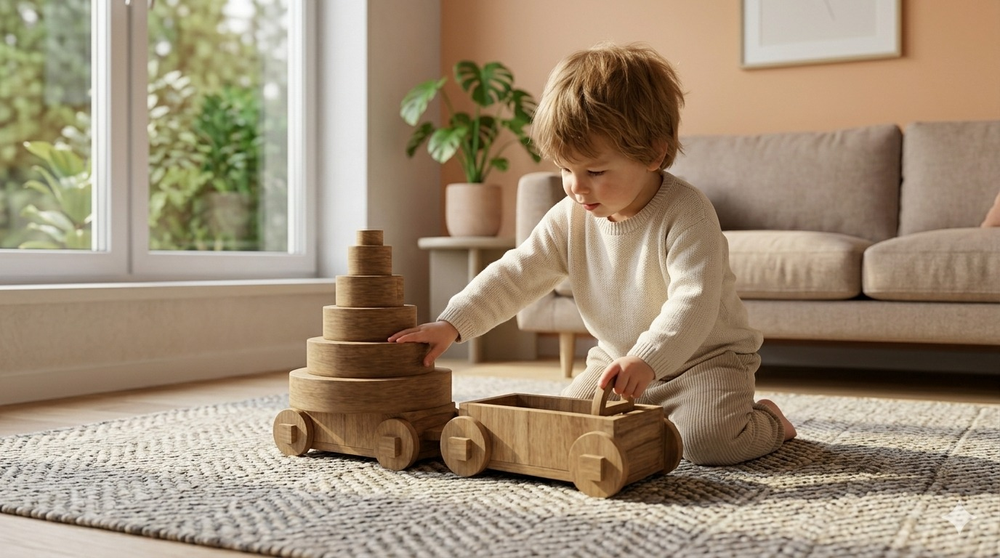
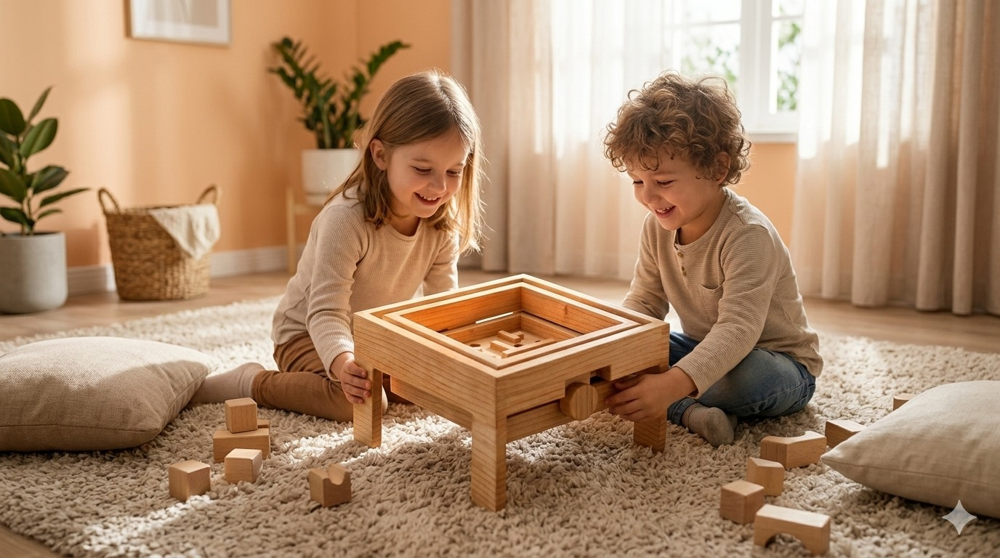
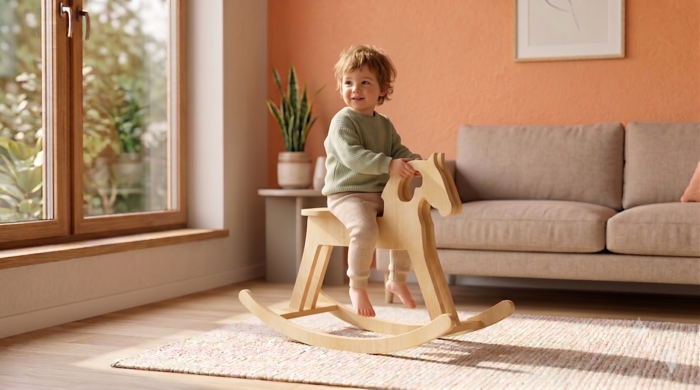

# A Crescer Contigo

> Onde a madeira ganha uma nova vida, a mente e corpo das crianças ganha asas para crescer.

## Elementos do Grupo

| Número  | Nome                |
| ------- | ------------------- |
| 2024274 | André Alves         |
| 2024348 | Gonçalo Lucas       |
| 2024271 | Guilherme Gonçalves |
| 2024309 | Leandro Arroio      |

---

## Contexto de Design

>Embora sejam quatro brinquedos diferentes, o **Combot, o Labirinto, o Carro de Empilhagem e o Cavalo de Baloiço** partilham o mesmo objetivo: promover o desenvolvimento cognitivo e a coordenação motora das crianças, ajudando-as a crescer de forma criativa e lúdica.

O grande trunfo desta coleção é o facto de **não serem brinquedos descartáveis**. Eles combatem a cultura do plástico e do consumismo rápido. Ao serem feitos de madeira reaproveitada, eles são duradouros e ganham um valor afetivo, adaptando-se às diferentes etapas do crescimento da criança.

Mais do que quatro peças isoladas, o **ComBot, o Labirinto, o Carro de Empilhagem e o Cavalo de Baloiço** formam uma linha de brinquedos evolutivos com um propósito único: transformar o desperdício em descoberta.

Nascidos a partir de madeira que teria sido descartada, estes objetos ganham uma segunda vida para guiar a infância das crianças. Cada um, à sua maneira, atua como um estímulo mental e físico. 

Juntos, partilham a mesma missão pedagógica: coordenar movimentos, expandir mentes e acompanhar o crescimento da criança de forma criativa, natural e profundamente lúdica.

No centro do nosso projeto está um material nobre, intemporal e vivo,**a madeira de pinho**. Mas mais importante do que a matéria-prima que escolhemos, é a forma como decidimos apresentá-la. Optámos por manter a madeira na sua forma mais autêntica e natural, sem tintas artificiais ou revestimentos industriais.

Esta decisão carrega um propósito claro: **ligar as crianças à terra**. O toque da madeira e as suas marcas oferecem uma experiência sensorial rica que os materiais sintéticos nunca conseguirão replicar. Ao tocar na madeira natural, a criança estabelece uma ligação direta com a natureza, despertando uma curiosidade instintiva e acalmando a mente para dar lugar à concentração.

Além disso, deixar a madeira desta forma é um convite aberto à criatividade sem limites. Cada objeto funciona como uma tela em branco. Damos às crianças a total liberdade para **pintar, desenhar e personalizar** as suas próprias peças. Ao colorirem a madeira, elas deixam de ser apenas utilizadoras e passam a ser co-criadoras do seu próprio universo de brincadeira.

Esta é a nossa filosofia: criar peças que não impõem regras, mas que abrem caminhos. Um espaço livre de regras rígidas onde as mentes mais jovens podem **imaginar, explorar e voar**.

Resumo, referências coletivas e moodboard do grupo encontram-se em [contexto.md](contexto.md).

[Ver contexto completo →](contexto.md)

---

## Galeria de Produtos

<!-- Cada thumbnail liga à página individual de cada produto.
     Cada produto vive em produtos/<numero>-<nome>/index.md
     e tem uma sub-página produtos/<numero>-<nome>/processo.md -->

<!-- markdownlint-disable MD033 -->

  <!-- duplicar o bloco abaixo para cada produto do grupo -->

  <a class="gallery-card" href="produtos/2024271-guilherme/">
    
    <h3>ComBot</h3>
    
Guilherme Gonçalves

  </a>
  <a class="gallery-card" href="produtos/2024274-andre/">
    
    <h3>Carro de Empilhagem</h3>
    
André Alves

  </a>
    <a class="gallery-card" href="produtos/2024309-leandro/">
    
    <h3>Labirinto</h3>
    
Leandro Arroio

  </a>
    <a class="gallery-card" href="produtos/2024348-goncalo/">
    
    <h3>Cavalo de Baloiço</h3>
    
Gonçalo Lucas

  </a>
  <!-- duplicar o bloco acima para cada produto do grupo  e substituir _modelo em ambas por <numero>-<nome> -->

<!-- markdownlint-enable MD033 -->
