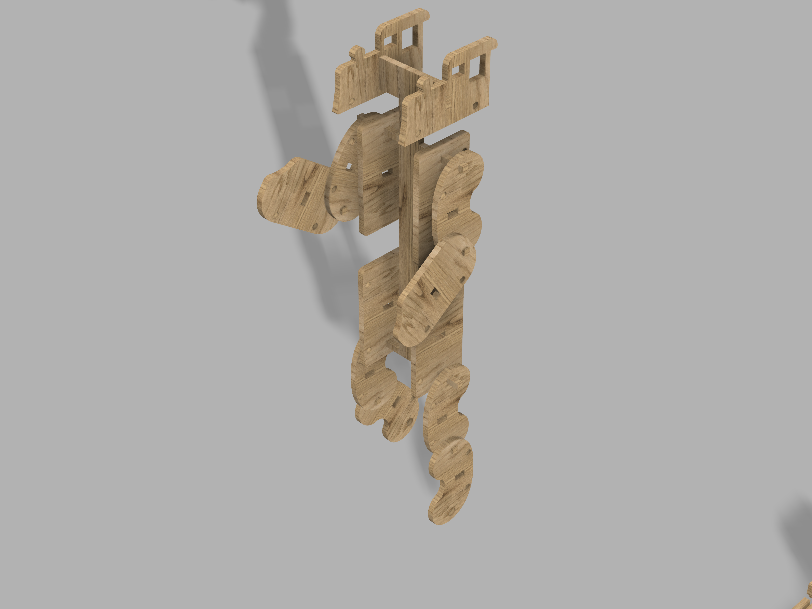

# ComBot

<!--
  HERO: idealmente uma pseudo-sessão fotográfica do produto
  (ver tutorial Pletor.ai nos Recursos da disciplina, em
  /Recursos/AI_exps/). Usa attachments/hero.jpg para o frontmatter.
-->

> Brinquedo que ajude a desenvolver a criatividade das crianças.

A página deve tornar **visualmente percetível** a estratégia de resposta ao enunciado.
Segue a estrutura de **prancha-resumo** + **esquema-base** (C-E-T-F).

## Conceito

O **ComBot** é um comboio de madeira de pinho concebido para potenciar a imaginação e a criatividade das crianças. Combinando o conceito de blocos de construção e figuras transformáveis, este brinquedo oferece uma dupla experiência. Pode ser conduzido como um comboio tradicional ou ser totalmente desmontado e reconstruído para dar forma a um robô. É acessível para todas as idades, no entanto, o ComBot foi desenhado especialmente para apoiar as crianças na sua fase essencial de desenvolvimento cognitivo e motor através do brincar, pois desconstroem o comboio para o construir num poderoso robô.

## Enquadramento

O projeto enquadra-se na filosofia sustentável do NESTOR, explorando a otimização de materiais e o aproveitamento industrial através do planeamento de corte inteligente. 

Este comboio de madeira inspira-se nos brinquedos de madeira já existentes e muito populares — brinquedos muito populares desde a Revolução Industrial. Partindo destes brinquedos como inspiração, decidi inovar um pouco sobre o que as pessoas pensam de um comboio de brincar de madeira, utilizando também os famosos Legos e os Transformers.

Este brinquedo contém várias peças que, montadas juntas, podem construir o seu próprio comboio de madeira ou o seu comboio robô de madeira. Sendo assim, este projeto irá influenciar positivamente a criatividade infantil, a sua coordenação e raciocínio, ao desafiar as crianças a construírem o seu brinquedo de uma forma divertida, tanto para se tornar um robô como para se tornar na locomotiva.

Fazendo assim com que a criança possa arranjar uma brincadeira divertida e distraente o suficiente, transformando-se assim num palco para a imaginação e criatividade atuar

## Tecnologia

Este comboio de madeira que se transforma em robô é fabricado a partir de madeira de pinho de 15 mm, uma matéria-prima excelente para o corte em CNC devido à sua baixa densidade, que facilita a maquinação e reduz o desgaste das fresas. Além disso, sendo uma madeira macia, oferece pouca resistência à passagem da ferramenta de corte, o que permite velocidades de avanço mais rápidas e uma menor exigência do motor da máquina. Trata-se de um material leve, económico e de fácil aquisição, ideal tanto para protótipos como para peças finais. Estas características garantem um maior aproveitamento do material, resultando num brinquedo preciso e com poucas ou nenhumas falhas.

O pinho corta de forma limpa,  aceitando muito bem tintas e vernizes, sendo que os seus veios naturais possuem um visual rústico e decorativo bastante apreciado. Relativamente ao processo de desenvolvimento, inicialmente foram realizados vários esboços para explorar as possibilidades de design. Em seguida, avançou-se para a fase de modelação 3D no software Fusion 360, permitindo que as formas fossem posteriormente cortadas na CNC para, finalmente, dar vida ao brinquedo.

- Modelo 3D: https://a360.co/43UFFT4<!-- embed Fusion ou link a360.co -->
- Ficheiros: `attachments/`

## Função

O **ComBot** de madeira funciona de uma forma muito dinâmica, oferecendo às crianças a liberdade de escolher qual das formas do brinquedo querem dar vida primeiro — sendo que a melhor parte é poderem fazê-lo quando e sempre que quiserem. 

Inicialmente, podem brincar com ele como se fosse um comboio de madeira tradicional, simulando que o estão a conduzir através de rodas totalmente funcionais que facilitam o movimento. Cada vagão apresenta uma forma geométrica diferente, não só para captar a atenção dos mais novos e estimular a sua imaginação, mas também para facilitar a montagem e moldagem do corpo do robô. Sendo também um brinquedo para um público abrangente de todas as idades, mas foi idealmente realizado para crianças desde 2 até aos 10 anos, podendo acompanhar o seu crescimento.

Ao transformá-lo em robô, abre-se um mundo de possibilidades onde as crianças podem brincar livremente, dando asas à criatividade e mergulhando no seu próprio universo imaginário.

## Apresentação

Imagens-chave que sintetizam o produto final.

---

## Processo

O percurso completo de iterações, modelos e pesquisa está em [processo.md](processo.md), organizado do **mais recente** para o **mais antigo**.

[Ver processo completo →](processo.md)
