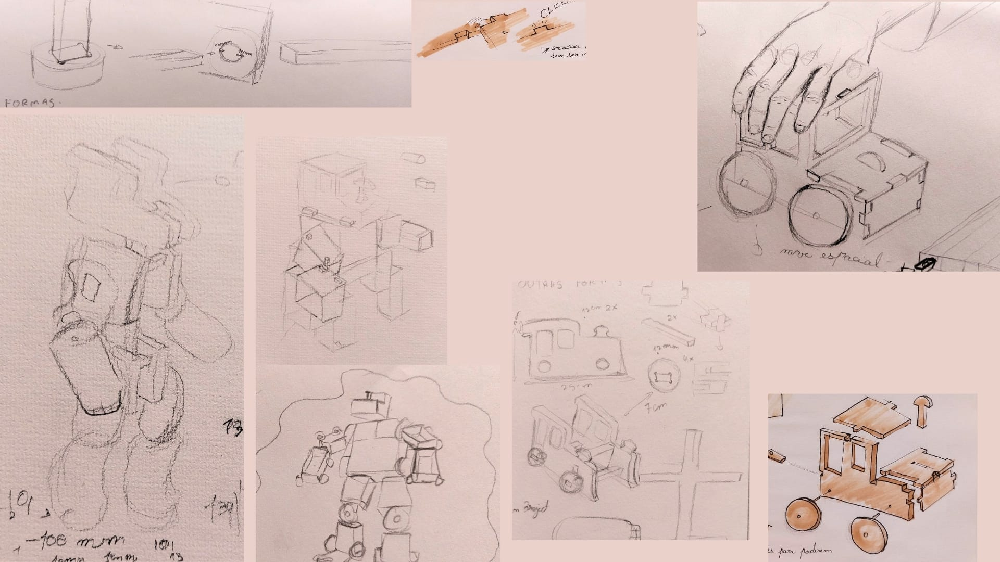

# ComBot

<!--
  HERO: idealmente uma pseudo-sessão fotográfica do produto
  (ver tutorial Pletor.ai nos Recursos da disciplina, em
  /Recursos/AI_exps/). Usa attachments/hero.jpg para o frontmatter.
-->

> Brinquedo que ajude a desenvolver a criatividade das crianças.

A página deve tornar **visualmente percetível** a estratégia de resposta ao enunciado.
Segue a estrutura de **prancha-resumo** + **esquema-base** (C-E-T-F).

## Conceito

O **ComBot** é um comboio de madeira de pinho concebido para potenciar a imaginação e a criatividade das crianças. Combinando o conceito de blocos de construção e figuras transformáveis, este brinquedo oferece uma dupla experiência. Pode ser conduzido como um comboio tradicional ou ser totalmente desmontado e reconstruído para dar forma a um robô. É acessível para todas as idades, no entanto, o ComBot foi desenhado especialmente para apoiar as crianças na sua fase essencial de desenvolvimento cognitivo e motor através do brincar, pois desconstroem o comboio para o construir num poderoso robô.

## Enquadramento

O projeto enquadra-se na filosofia sustentável do NESTOR, explorando a otimização de materiais e o aproveitamento industrial através do planeamento de corte inteligente. 

Este comboio de madeira inspira-se nos brinquedos de madeira já existentes e muito populares — brinquedos muito populares desde a Revolução Industrial. Partindo destes brinquedos como inspiração, decidi inovar um pouco sobre o que as pessoas pensam de um comboio de brincar de madeira, utilizando também os famosos Legos e os Transformers.

Este brinquedo contém várias peças que, montadas juntas, podem construir o seu próprio comboio de madeira ou o seu comboio robô de madeira. Sendo assim, este projeto irá influenciar positivamente a criatividade infantil, a sua coordenação e raciocínio, ao desafiar as crianças a construírem o seu brinquedo de uma forma divertida, tanto para se tornar um robô como para se tornar na locomotiva.

Fazendo assim com que a criança possa arranjar uma brincadeira divertida e distraente o suficiente, transformando-se assim num palco para a imaginação e criatividade atuar

## Tecnologia

Materiais (espécie de madeira), processos de fabrico (CNC, laser, impressão 3D), software paramétrico, ficheiros técnicos.

- Modelo 3D: https://a360.co/43UFFT4<!-- embed Fusion ou link a360.co -->
- Ficheiros: `attachments/`

## Função

Como se brinca, idade-alvo, montagem, conformidade com a Diretiva 2009/48/CE.

## Apresentação

Imagens-chave que sintetizam o produto final.

---

## Processo

O percurso completo de iterações, modelos e pesquisa está em [processo.md](processo.md), organizado do **mais recente** para o **mais antigo**.

[Ver processo completo →](processo.md)
