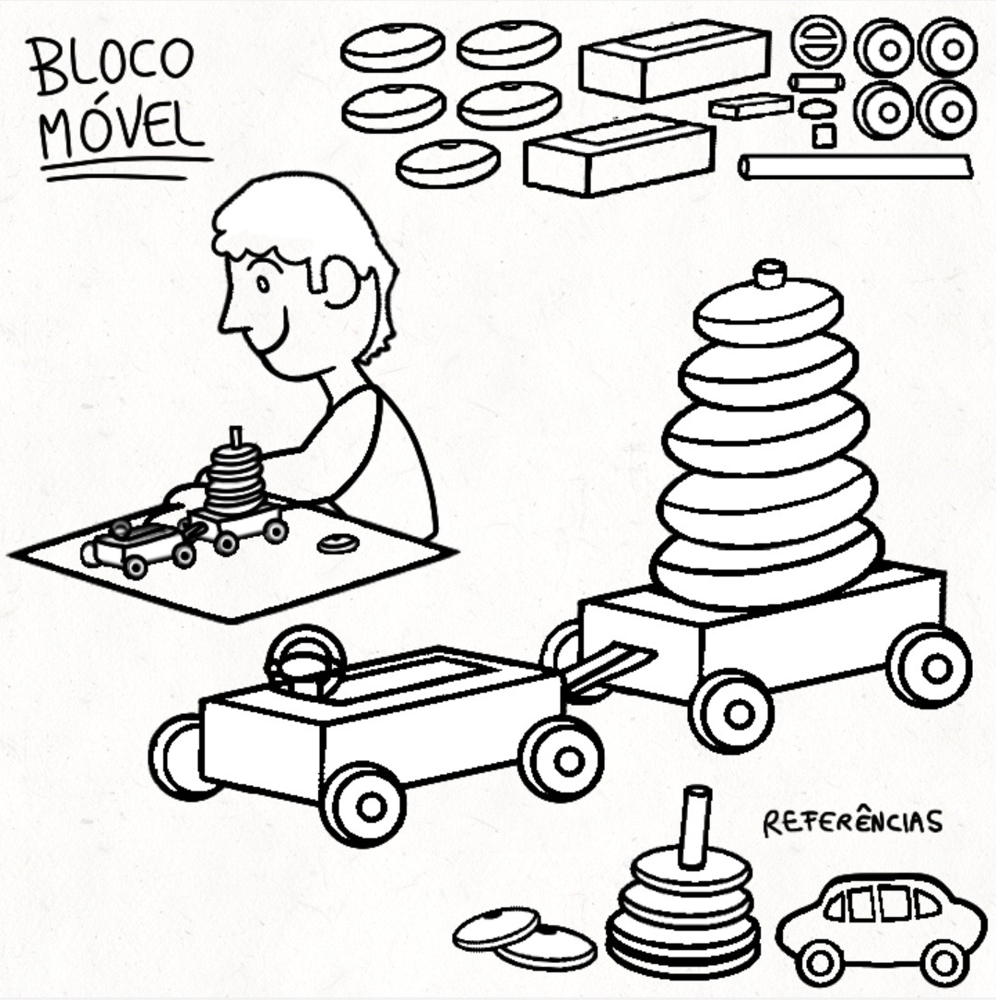
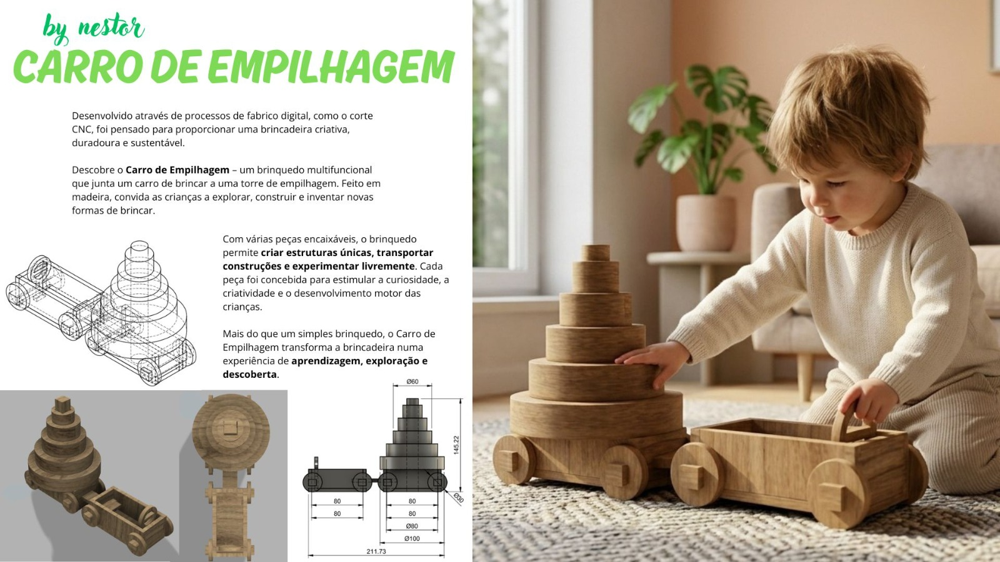

# Carrinho de Empilhagem

<!--
  HERO: idealmente uma pseudo-sessão fotográfica do produto
  (ver tutorial Pletor.ai nos Recursos da disciplina, em
  /Recursos/AI_exps/). Usa attachments/hero.jpg para o frontmatter.
-->

> Frase-conceito (uma linha): qual é a proposta?

A página deve tornar **visualmente percetível** a estratégia de resposta ao enunciado.
Segue a estrutura de **prancha-resumo** + **esquema-base** (C-E-T-F).

## Conceito

- O que é?
O produto consiste num brinquedo infantil de madeira que combina duas funções principais: um carro de brincar e uma torre de empilhar composta por peças de diferentes formas e tamanhos. A integração destas duas atividades promove uma experiência lúdica mais completa, permitindo à criança explorar simultaneamente o movimento e a construção.

- Para quem?
O brinquedo destina-se principalmente a crianças entre os 3 aos 6 anos de idade. É adequado tanto para utilização em ambiente doméstico como em contextos educativos, como creches e jardins de infância.

- Porquê?
A escolha deste brinquedo baseia-se na sua capacidade de estimular competências essenciais durante a infância. O ato de empilhar favorece o desenvolvimento da coordenação motora fina, da perceção espacial e da resolução de problemas. Por outro lado, a função de carro incentiva o movimento, a imaginação e a exploração do espaço envolvente. A utilização da madeira como material principal reforça valores de sustentabilidade, durabilidade e segurança, o que oferece uma alternativa aos brinquedos produzidos em plástico.

## Enquadramento

- É sustentável?
Como é produzido em madeira, um material renovável e com menor impacto ambiental comparando com muitos materiais plásticos, o brinquedo é, sem dúvida, sustentável. A sua durabilidade permite uma utilização prolongada, reduzindo a necessidade de substituição frequente e contribuindo para um consumo mais sustentável.

- Explora bem o material?
A madeira é explorada de forma adequada através do aproveitamento de características naturais como a resistência e a estabilidade, o que permite a criação de peças sólidas e seguras, sendo adequado para qualquer criança.

- Onde me inspirei?
O desenvolvimento deste brinquedo foi inspirado nos dois brinquedos combinados: carros de brincar e torres de empilhagem. A união destes conceitos permitiu criar um objeto multifuncional que associa o movimento à construção.

- O que é que o objeto promove?
O brinquedo promove o desenvolvimento da criatividade e da perceção espacial, incentivando a imaginação, a exploração do espaço e a aprendizagem através da brincadeira.

## Tecnologia

- Qual a grossura da madeira?
O brinquedo é produzido em madeira com uma espessura adequada para garantir segurança durante a utilização. As dimensões gerais do produto são aproximadamente 14,6cm de altura e 19,4cm de comprimento, enquanto que o contraplacado é de 0.5cm.

- Onde seria cortado?
As peças seriam fabricadas através de corte CNC, permitindo obter formas precisas e um elevado rigor dimensional.

- Como são as peças?
O conjunto é composto por várias peças geométricas de diferentes formas e tamanhos. Sejam retangulares, circulares ou cilíndricas, estas peças encaixam entre si, estimulando a estratégia da criança.

- Como é feita a montagem?
A montagem é realizada através de encaixes, permitindo uma montagem simples, segura e intuitiva. Para facilitar, diversas peças da mesma forma, como as retangulares e quadrangulares, são encaixadas umas nas outras.

- Modelo 3D: -  https://a360.co/43r8WEW
<!-- embed Fusion ou link a360.co -->
- Ficheiros: `attachments/`

## Função

- Como funciona?
Como o brinquedo combina um veículo de brincar com uma estrutura de empilhagem, os discos de empilhar são montados ao colocá-los na torre da parte traseira do carro, formando diferentes configurações e permitindo várias formas de utilização.

- O que é suposto fazer?
O produto foi concebido para proporcionar momentos de diversão enquanto contribui para o desenvolvimento de competências cognitivas e criativas.

- Como se brinca?
A criança pode utilizar o brinquedo como um carro de brincar, movimentando-o livremente pelo espaço, mas também pode construir e reorganizar a torre utilizando as peças disponíveis, explorando diferentes combinações através da imaginação e do jogo criativo.
## Apresentação

Imagens-chave que sintetizam o produto final.

---

## Processo

O percurso completo de iterações, modelos e pesquisa está em [processo.md](processo.md), organizado do **mais recente** para o **mais antigo**.

[Ver processo completo →](processo.md)
