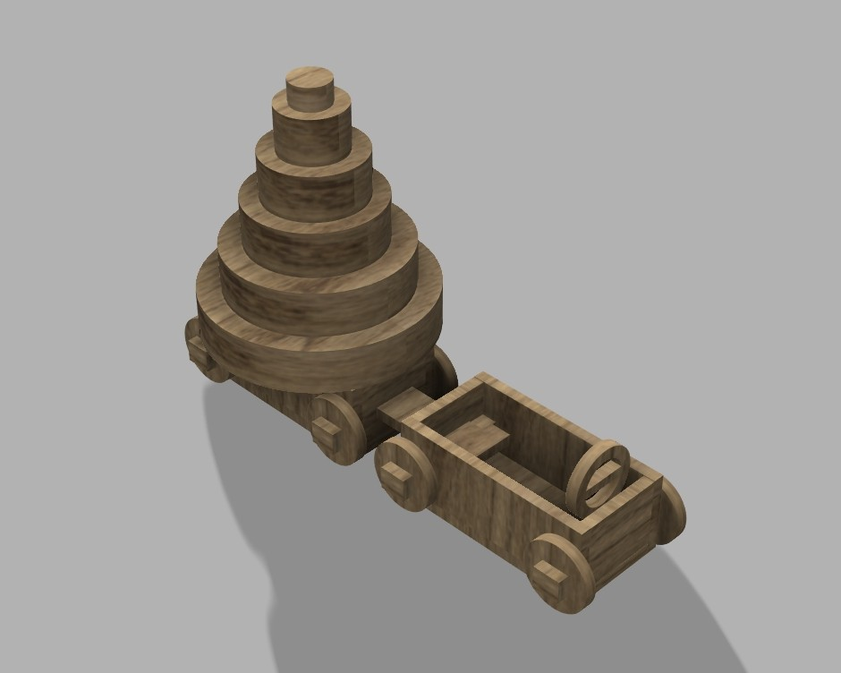
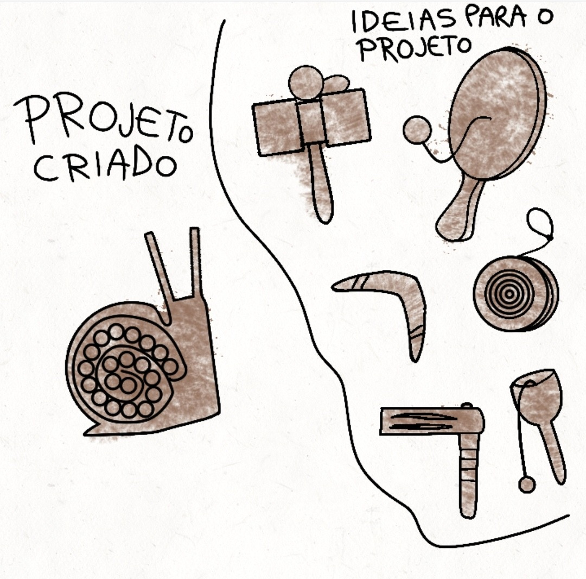
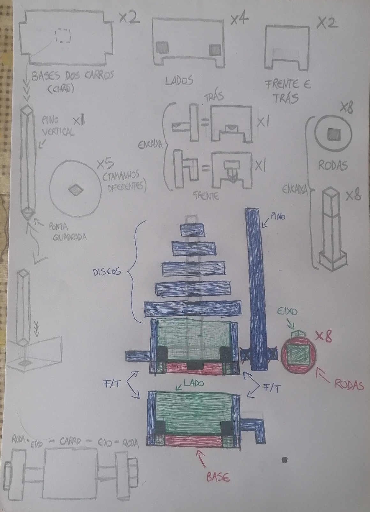
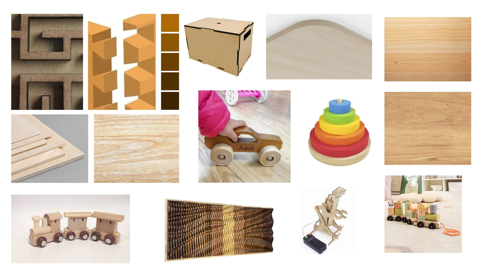

# Processo

> Organizado do **mais recente** para o **mais antigo**. Faz uma seleção que torne clara, aprazível e detalhada a evolução do produto e das ideias.

## 1. Protótipo(s)

Fotografias em estúdio com fundo branco do(s) protótipo(s) final(is).

## 2. Modelos 3D

Embed do Fusion (visualização do modelo paramétrico).

https://a360.co/43r8WEW

## 3. Esboços e Pranchas-Resumo

Desenhos manuais, 
pranchas A3 de síntese, 
exploração de variantes.

## 4. Pesquisa

### 4.1. Aspectos valorizados do moodboard, desconstrução da forma (o que distingue o programa formal)

### 4.2. Objetos de referencia

Para o desenvolvimento deste projeto, as principais referências retiradas do moodboard foram um carro de brincar em madeira e uma torre de empilhagem infantil. O carro serviu de inspiração para a forma geral do brinquedo e para a componente de movimento, permitindo que a criança o possa deslocar livremente durante a brincadeira. Por outro lado, a torre de empilhagem inspirou a criação das peças modulares que podem ser montadas e organizadas de diferentes formas, incentivando a criatividade, a coordenação motora fina e a perceção espacial. A combinação destas duas referências permitiu desenvolver um produto multifuncional que reúne características de um veículo de brincar e de um brinquedo de construção, proporcionando uma experiência lúdica mais completa e diversificada.

## 5. Outros Elementos

A principal inovação deste projeto consiste na simples combinação de um carro de brincar com uma torre de empilhagem. Embora estes brinquedos existam normalmente de forma separada, neste projeto foram integrados num só produto, permitindo diferentes formas de interação e utilização. O brinquedo possibilita que a criança construa, reorganize e transporte as peças utilizando o próprio carro, criando uma ligação entre a atividade de construção e a brincadeira em movimento. Esta combinação aumenta as possibilidades de exploração e estimula simultaneamente competências motoras, cognitivas e criativas. Além disso, o sistema de encaixe das peças permite uma montagem simples, intuitiva e segura. Desta forma, o produto distingue-se pela sua versatilidade, multifuncionalidade e capacidade de promover diferentes experiências de aprendizagem através da brincadeira.