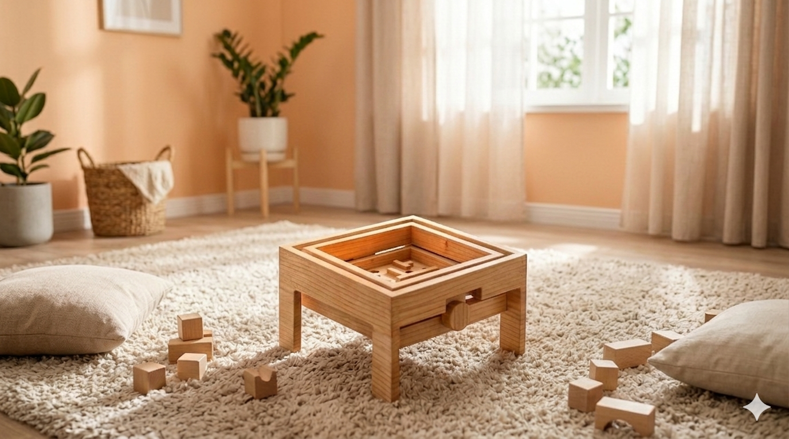

# Labirinto

<!--
  HERO: idealmente uma pseudo-sessão fotográfica do produto
  (ver tutorial Pletor.ai nos Recursos da disciplina, em
  /Recursos/AI_exps/). Usa attachments/hero.jpg para o frontmatter.
-->

> Brinquedo que ajuda a desenvolver foco e noção de equilíbrio

## Conceito

O Labirinto é uma reinvenção analógica e minimalista do labirinto clássico de madeira. Ao eliminar engrenagens, fios e molas, o jogo desafia a criança através de uma mecânica puramente física e intuitiva. Controlado diretamente com as duas mãos, exige um domínio fluido do eixo de rotação (frente/trás) combinado com o balanço lateral (esquerda/direita), e assim estimulamos o foco, a paciência e a cordenação motora das crianças.

## Enquadramento

O projeto enquadra-se na filosofia sustentável do NESTOR, explorando a otimização de materiais e o aproveitamento industrial através do planeamento de corte inteligente.

## Tecnologia

**Materiais:** O brinquedo será produzido em contraplacado de 15 mm de espessura, de forma a garantir a robustez necessária, mantendo a simplicidade e o minimalismo do produto.

**Processos de Fabrico:** O fabrico será realizado através de corte em CNC (Controlo Numérico Computorizado). Este processo garante a máxima precisão dimensional e o rigor técnico necessário, especialmente no corte das calhas do próprio labirinto, assegurando que todos os componentes encaixam e funcionam perfeitamente.

**Métodos:** Para a montagem, será aplicada a técnica de _dogbones_ (alívios de canto) nos encaixes de determinadas secções do labirinto. Esta solução será utilizada, por exemplo, nas pegas que controlam a rotação do eixo (frente/trás), permitindo que este mecanismo gire de forma suave e precisa, sem folgas estruturais.

- Modelo 3D: <!-- embed Fusion ou link a360.co --> https://a360.co/4ojGNZM
- Ficheiros: `attachments/`

## Função

O labirinto tem como função ajudar as crianças a desenvolver o equilíbrio, através de movimentos de rotação (para a frente e para trás) e de deslocação lateral (esquerda e direita) com o balançar das mãos. Trabalha também o foco e a concentração, bem como a própria coordenação motora, uma vez que o objetivo é não deixar cair a bola.

O brinquedo é destinado a uma faixa etária dos 5 aos 10 anos, visto que o tamanho da bola pode ser perigoso para crianças entre os 2 e os 4 anos. O labirinto foi desenhado 'fora da caixa' para fugir à ideia fechada do modelo tradicional de madeira, apresentando um formato ergonómico que permite às crianças utilizá-lo de forma mais fácil e sem complicações.

## Apresentação

---

## Processo

O percurso completo de iterações, modelos e pesquisa está em [processo.md](processo.md), organizado do **mais recente** para o **mais antigo**.

[Ver processo completo →](processo.md)
