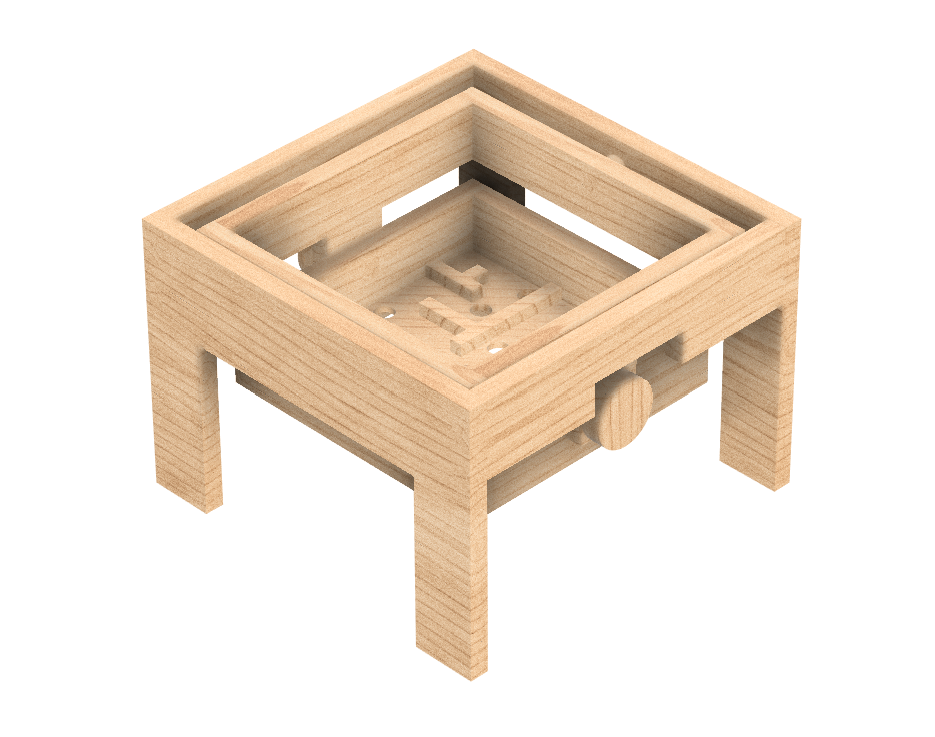
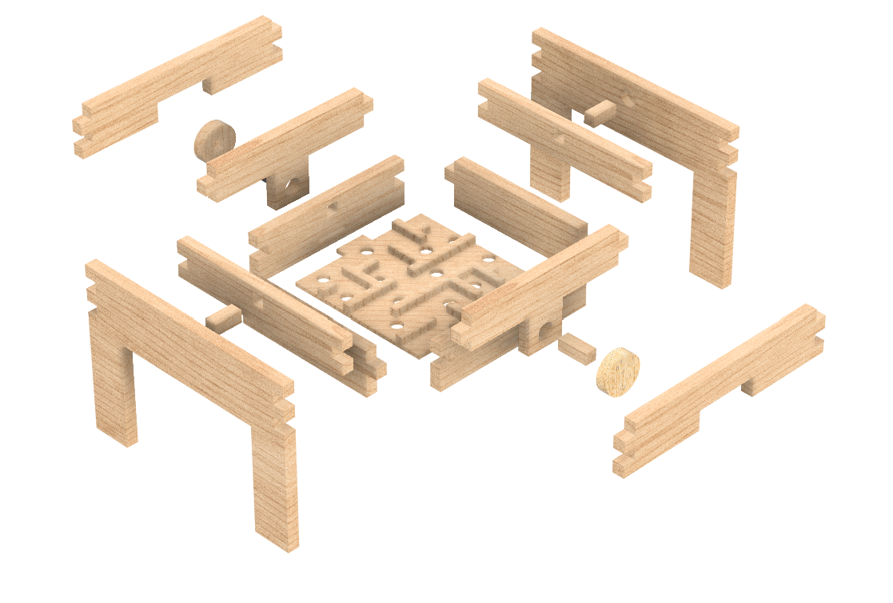
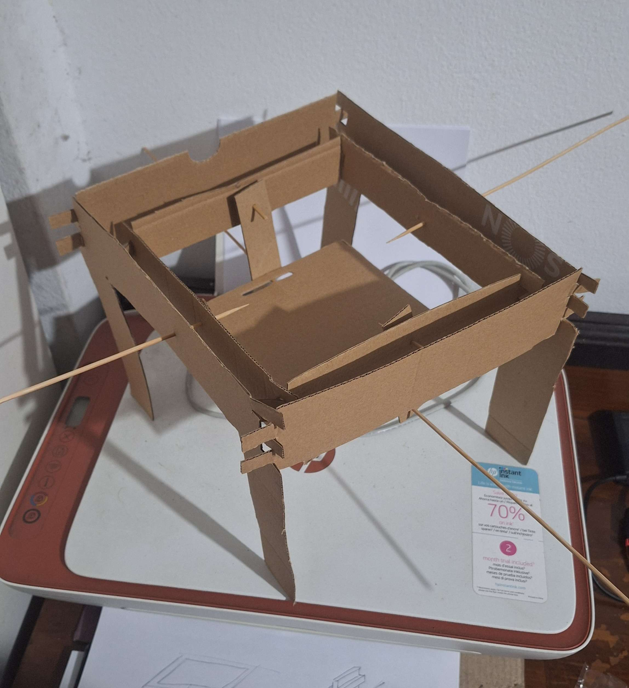
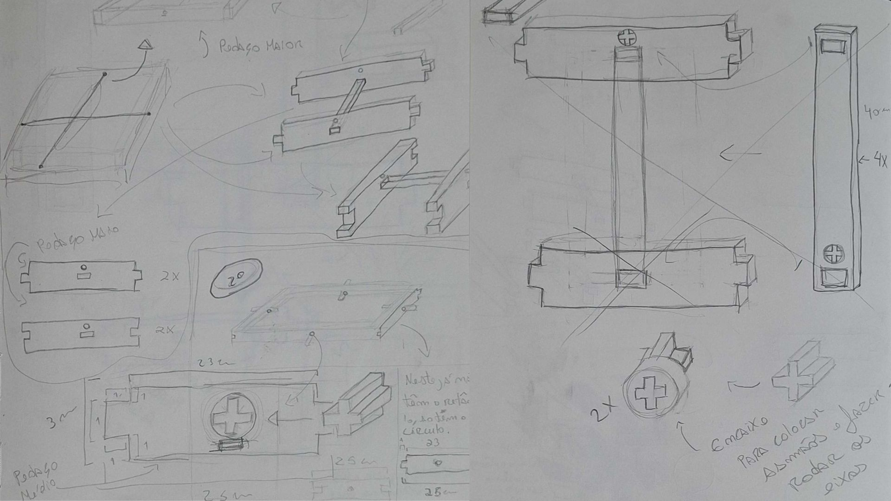
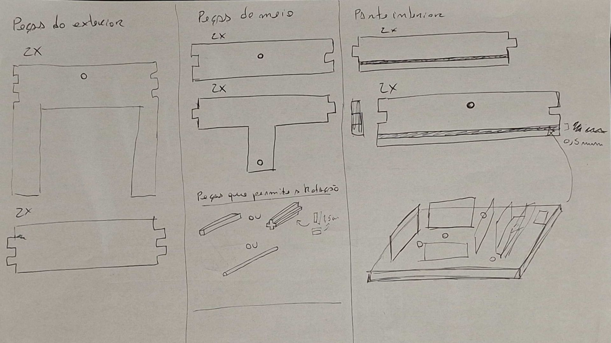
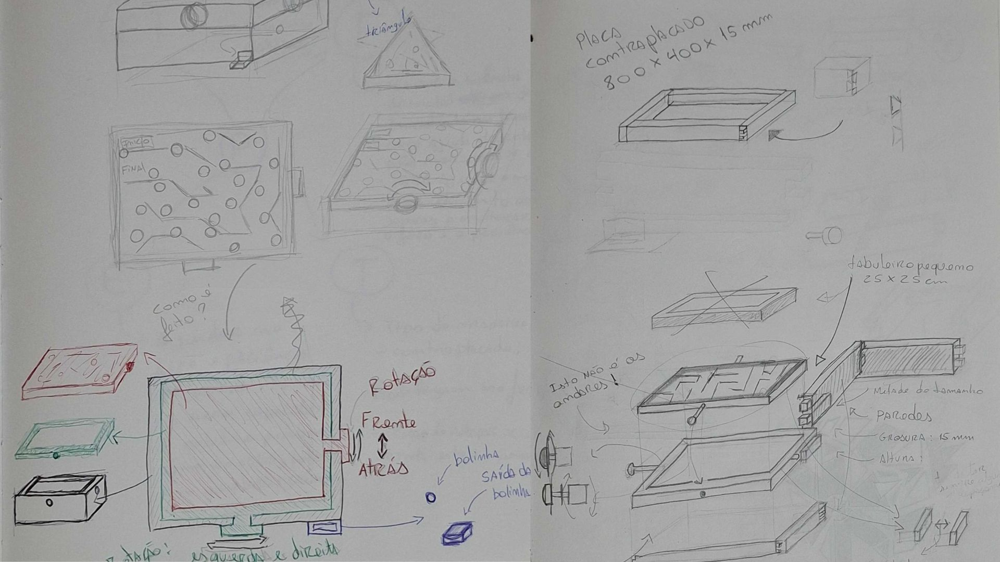
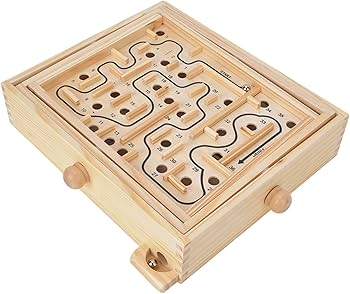

# Processo

> Organizado do **mais recente** para o **mais antigo**. Faz uma seleção que torne clara, aprazível e detalhada a evolução do produto e das ideias.

## 1. Protótipo(s)

Fotografias em estúdio com fundo branco do(s) protótipo(s) final(is).

## 2. Modelos 3D

Embed do Fusion (visualização do modelo paramétrico).

https://a360.co/4ojGNZM

## 3. Outros Modelos

Aqui temos a maquete que elaborei antes da construção no Fusion, para testar o que funcionava e o que não funcionava. Foi aqui que descobri que poderia simplesmente utilizar as duas mãos para **o** rodar no eixo frente/trás e, ao mesmo tempo, balançá-lo para a esquerda e para a direita.

## 4. Esboços e Pranchas-Resumo

Estão representados os esboços e as pranchas-resumo do percurso, desde o início até ao resultado final.

Inicialmente, tinha a ideia de fazer um labirinto de três andares. No entanto, como percebi que tapar a visão **às** crianças no andar de baixo não seria uma boa solução, lembrei-me do que o professor me tinha recomendado (fazer um labirinto 'fora da caixa'). Foi daí que surgiu a ideia de criar o labirinto que tenho atualmente.

## 5. Pesquisa

### 5.1. Aspectos valorizados do moodboard, desconstrução da forma (o que distingue o programa formal)

Este brinquedo segue inicialmente a lógica de um labirinto de madeira comum, mas diferencia-se totalmente na sua estrutura. Em vez de ser uma caixa fechada e colada, a sua forma foi desconstruída num conjunto de peças de madeira que se encaixam de forma inteligente, como se pode ver na vista explodida. O que distingue este brinquedo de todos os outros é o seu sistema de rotação: a criança consegue usar as duas mãos ao mesmo tempo para rodar o eixo para a frente e para trás e, em simultâneo, balançá-lo para a esquerda e para a direita, guiando a bola através do movimento do próprio corpo.

### 5.2. Objetos de referencia

Inventário de precedentes, brinquedos análogos, referências históricas.

## 6. Outros Elementos

Para melhorar este trabalho, poderia ter feito um suporte ou uma gaveta por baixo do tabuleiro, para que a bola não caísse no chão com o risco de se perder. 