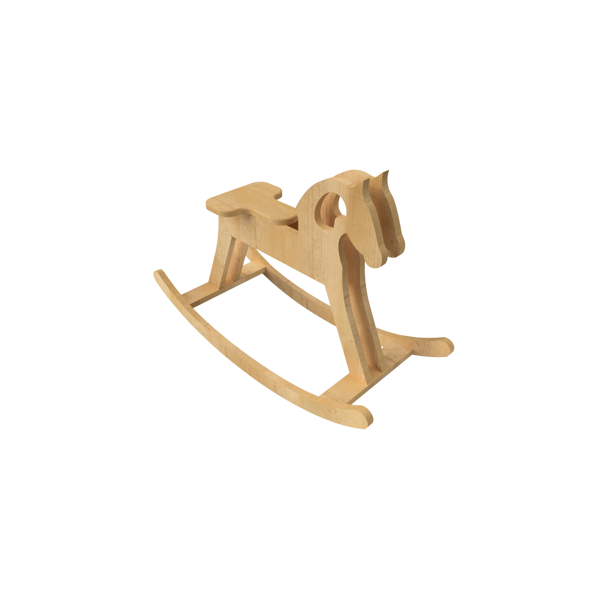
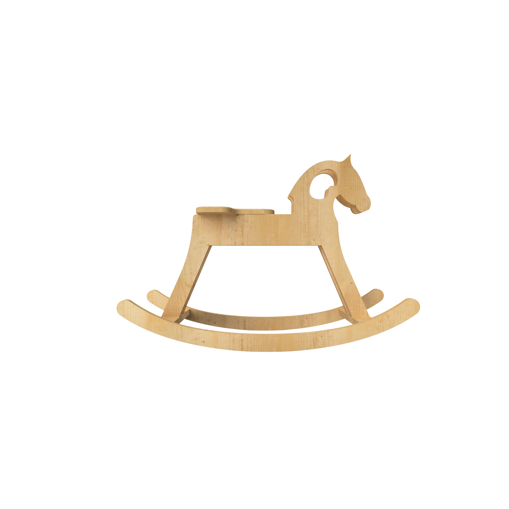
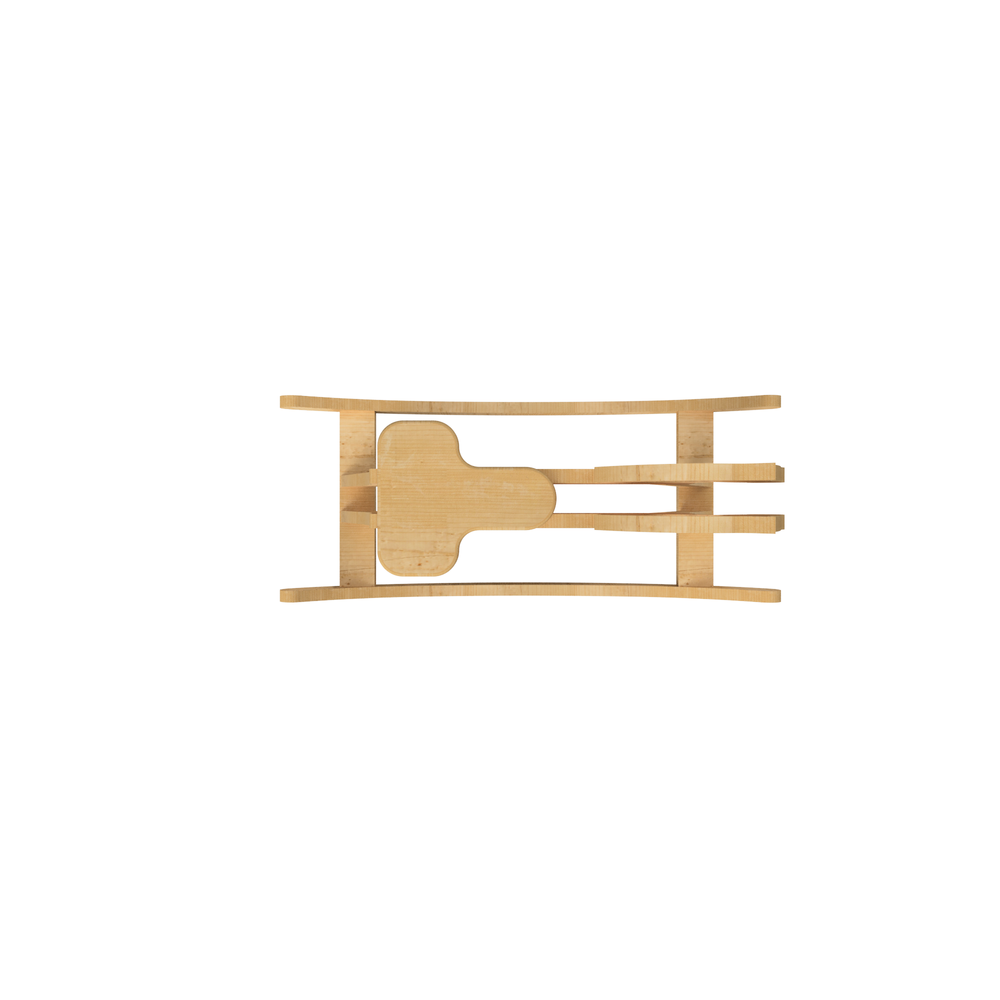
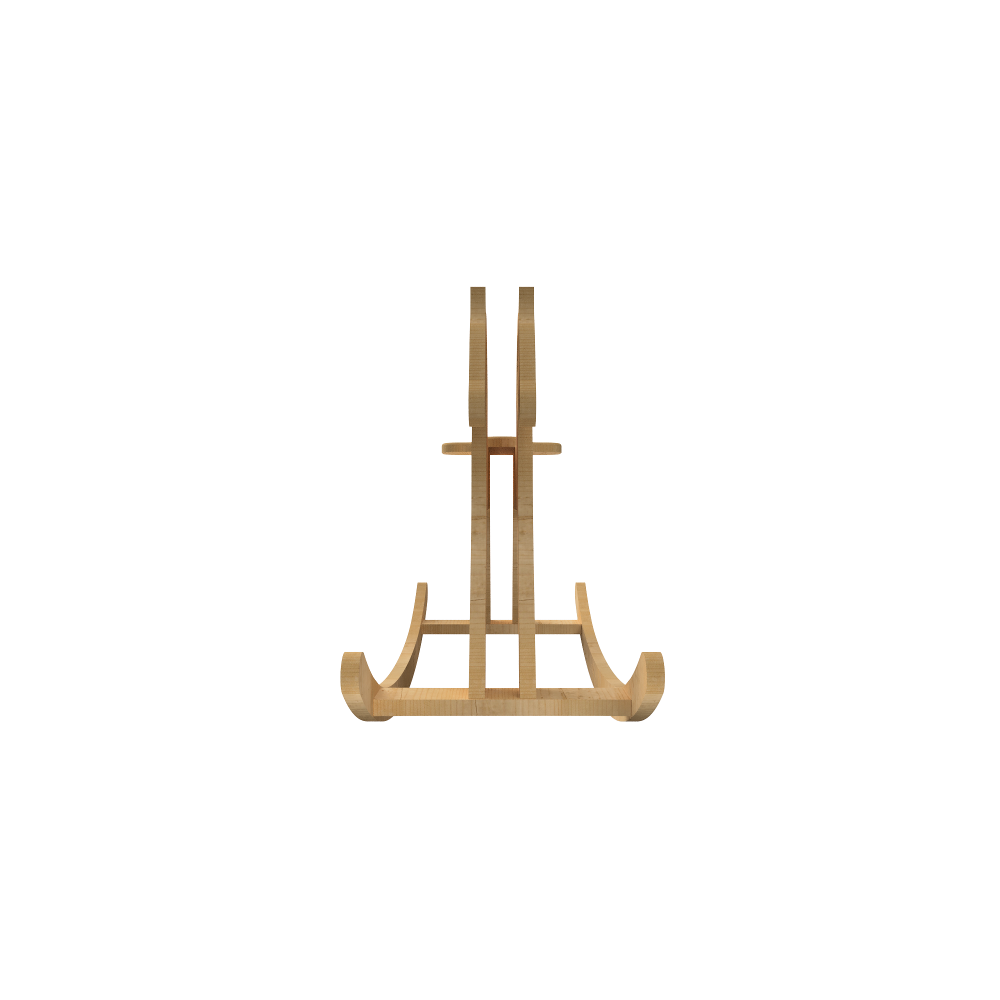
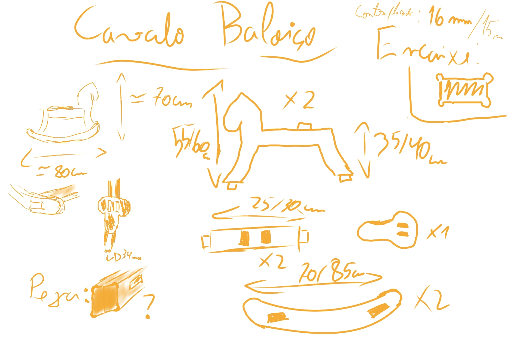
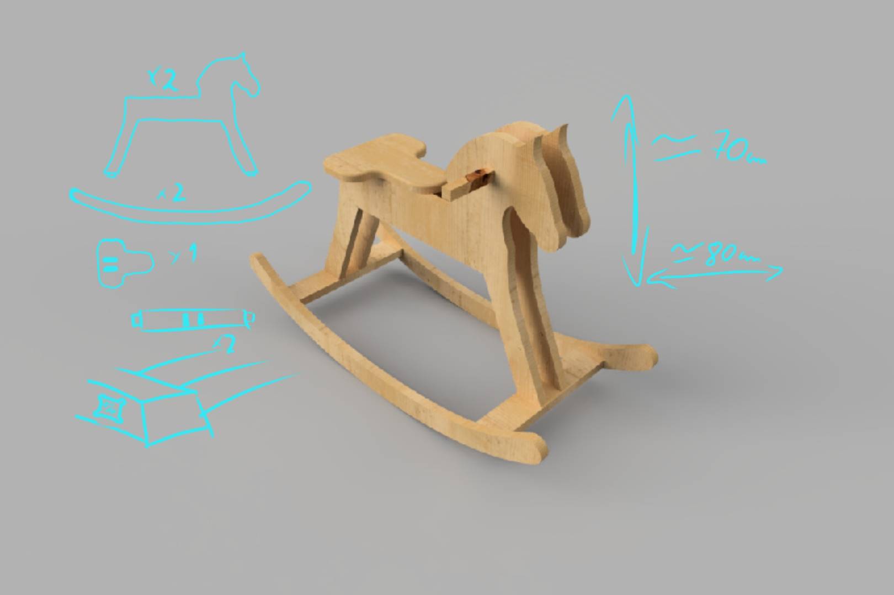
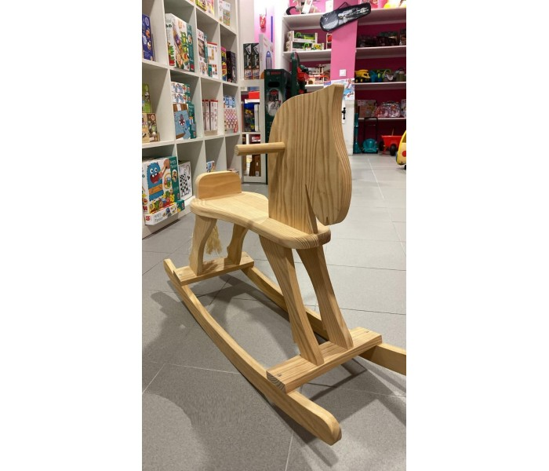
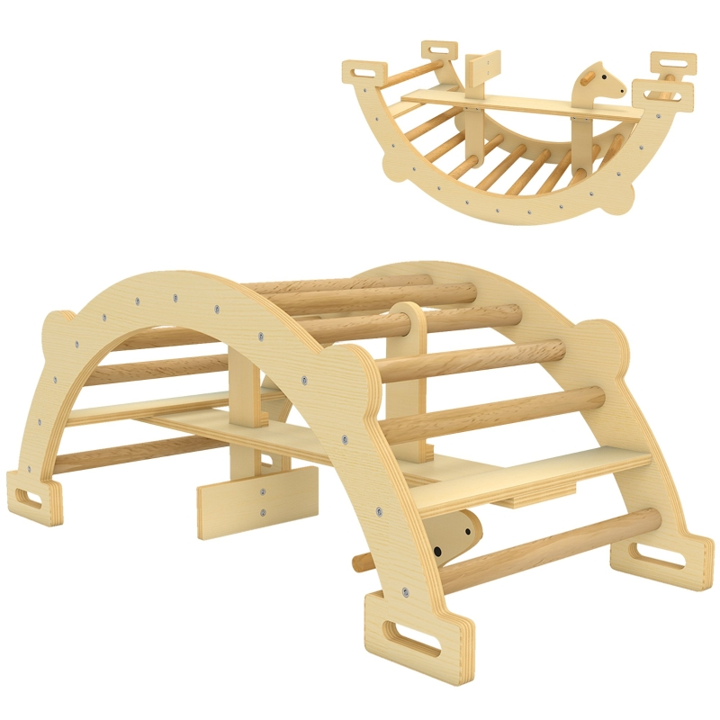

# Processo

> Organizado do **mais recente** para o **mais antigo**. 

## 1. Protótipo(s)

Fotografias em estúdio com fundo branco do(s) protótipo(s) final(is).

## 2. Modelos 3D

Embed do Fusion (visualização do modelo paramétrico).

[https://a360.co/4nqYoPa](https://a360.co/4a9OCM7)

## 3. Esboços e Pranchas-Resumo

Desenhos manuais, 
pranchas A3 de síntese, 
exploração de variantes.

## 4. Pesquisa

### 4.1. Aspectos valorizados do moodboard, desconstrução da forma (o que distingue o programa formal)

A silhueta clássica e orgânica do cavalo de baloiço tradicional foi analisada e simplificada através de uma **decomposição em planos bidimensionais interligados**. Esta desconstrução geométrica permitiu transformar uma forma tipicamente volumétrica e esculpida num sistema eficiente de chapas de pinho que se cruzam ortogonalmente.

Ao contrário dos cavalos de baloiço convencionais que assentam em estruturas complexas de carpintaria ou fixações metálicas, o programa formal deste objeto distingue-se pela sua **honestidade construtiva**. Cada vetor e corte serve simultaneamente uma função estética e estrutural:

- As placas laterais definem a identidade visual do animal.
    
- O corte circular na zona da cabeça atua como desmaterialização formal e pega ergonómica.
    
- Os rasgos verticais e horizontais ditam o travamento rígido do objeto através da própria matéria-prima.

### 4.2. Objetos de referencia

Inventário de precedentes, brinquedos análogos, referências históricas.

## 5. Outros Elementos

O brinquedo partilha dos seus princípios fundamentais: **a autonomia, a exploração sensorial através do tato na madeira natural (pinho) e o controlo do próprio corpo**.

Ao interagir com o cavalo, a criança (especialmente na faixa etária alargada dos 2 aos 8 anos) desenvolve a motricidade grossa, o equilíbrio dinâmico e a autoconfiança através da repetição mecânica do baloiço, gerida pelo seu próprio peso e impulso.

### Influências Visuais e Técnicas

- **Simplificação Formal:** A procura por formas orgânicas e silhuetas que apelem ao imaginário infantil sem sobrecarregar visualmente o objeto.
    
- **Cultura Maker e Open Design:** O projeto celebra a cultura do "fazer", onde a lógica de montagem por pressão com _dogbones_ confere ao brinquedo um aspeto pedagógico mesmo antes de ser utilizado: a própria estrutura revela à criança como o objeto se suporta de pé.
    
- **Customização Neutra:** O acabamento lavado e natural do pinho cumpre o propósito de deixar o design "em aberto", permitindo que o cavalo funcione como uma tela em branco para a expressão artística das crianças ou dos pais através da pintura.